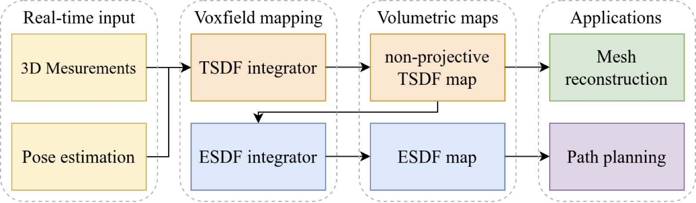
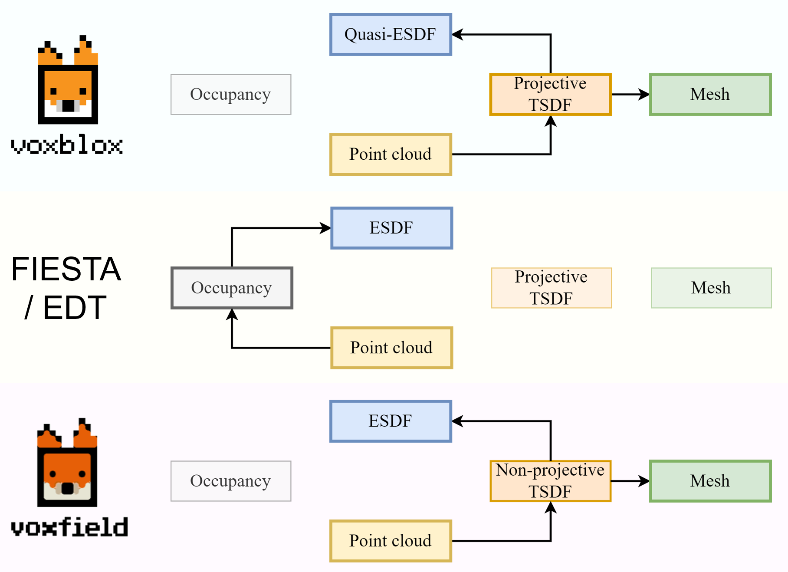

This repository represents the official implementation of the paper:

## Voxfield: non-Projective Signed Distance Fields for Online Planning and 3D Reconstruction

*Yue Pan*, *Yves Kompis*, *Luca Bartolomei*, *Ruben Mascaro*, *Cyrill Stachniss*, *Margarita Chli*

[ETH Zurich](https://v4rl.ethz.ch/) | [University of Bonn](https://www.ipb.uni-bonn.de/)

[**1-min demo video**](https://www.youtube.com/watch?v=QbH1aT3zAvs&feature=youtu.be) | **paper** | **thesis report**




---

Voxfield is an improved version of the volumetric mapping framework [**Voxblox**](https://github.com/ethz-asl/voxblox) on both the mapping accuracy and efficiency. 
Voxfield is heavily based on the original [**Voxblox**](https://github.com/ethz-asl/voxblox) implementation, with the additional capacity of a non-projective TSDF integration and an efficient ESDF integration based on TSDF map. The constructed TSDF and ESDF map can be used for 3D reconstruction and robot path planning in real-time.

This repository also provides the implementation of other state-of-the-art methods ([Voxblox](https://arxiv.org/abs/1611.03631), [FIESTA](https://arxiv.org/abs/1903.02144), [EDT](https://arxiv.org/abs/2105.04419)) on this task. A comparison of these methods' workflow are shown below.



Voxfield can be also seamlessly integrated into those projects that originally use Voxblox as their volumetric mapping backbone (Cblox, Voxgraph, Kimera, etc). To make Voxfield directly compatible to those projects, we keep the name of our package as voxblox. In addition, we provide an example on a multi-resolution panoptic mapping framework [**Panmap**](https://github.com/VIS4ROB-lab/voxfield-panmap) for high-fidelity large-scale semantic reconstruction. 


## Installation

If you have installed ROS, set up the catkin workspace and the SSH key for github, you can use the following commands to install Voxfield:

```
cd ~/catkin_ws/src/
git clone git@github.com:VIS4ROB-lab/voxfield.git
wstool init . ./voxfield/voxfield_ssh.rosinstall     # If you created a new workspace
wstool merge -t . ./voxfield/voxfield_ssh.rosinstall # If you use an existing workspace
wstool update
```

And then compile Voxfield with:

```
cd ~/catkin_ws/src/
catkin build voxblox_ros
```

To avoid the potential conflict, if the original voxblox was installed, it's better to remove voxblox from `catkin_ws/src`.

For more details, please follow these [instructions](https://voxblox.readthedocs.io/en/latest/pages/Installation.html).

## Instructions

- To run the non-projective TSDF mapping and ESDF mapping of the proposed Voxfield, use the executables: ```np_tsdf_server``` and ```voxfield_server```. 
- To run the original TSDF mapping and ESDF mapping of Voxblox, use the executables: ```tsdf_server``` and ```voxblox_server```. 
- To run the ESDF mapping of FIESTA, use the executables: ```fiesta_server```.
- To run the ESDF mapping of EDT, use the executables: ```voxedt_server```.
- List of the ros services can be found [here](https://voxblox.readthedocs.io/en/latest/pages/The-Voxblox-Node.html), which should be the same as Voxblox.

## Example Usage

### Run on the Cow & Lady real-world RGB-D dataset

1. Download the dataset [here](https://projects.asl.ethz.ch/datasets/doku.php?id=iros2017) or use the following command in a target folder:

```
wget http://robotics.ethz.ch/~asl-datasets/iros_2017_voxblox/data.bag
wget http://robotics.ethz.ch/~asl-datasets/iros_2017_voxblox/voxblox_cow_extras.zip
```

2. Set the `bag_file` path in the launch files `./voxblox_ros/launch/voxfield_launch/cow_voxfield.launch` to the path storing the Cow & Lady bag file.
3. Run Voxfield mapping on the Cow & Lady dataset:

```
roslaunch voxblox_ros cow_voxfield.launch
```

### Run on the KITTI real-world LiDAR or stereo dataset

1. Download the full dataset [here](http://www.cvlibs.net/datasets/kitti/eval_odometry.php) or a rosbag of sequence07 [here](https://drive.google.com/file/d/1_qUfwUw88rEKitUpt1kjswv7Cv4GPs0b/view).
   Then use the [kitti_to_rosbag](https://github.com/ethz-asl/kitti_to_rosbag) package to convert the full dataset to rosbags.
2. Set the `bag_file` path in the launch files `./voxblox_ros/launch/voxfield_launch/kitti_voxfield.launch` to the path storing the KITTI bag file.
3. Run Voxfield mapping on the KITTI dataset:

```
roslaunch voxblox_ros kitti_voxfield.launch
```

### Run on the MaiCity synthetic LiDAR dataset

1. Download the dataset [here](https://www.ipb.uni-bonn.de/data/mai-city-dataset/) or use the following command in a target folder:

```
wget https://www.ipb.uni-bonn.de/html/projects/mai_city/mai_city.tar.gz
tar -xvf mai_city.tar.gz
```

2. Set the `bag_file` path in the launch files `./voxblox_ros/launch/voxfield_launch/mai_voxfield.launch` to the path storing the MaiCity bag file.
3. Run Voxfield mapping on the MaiCity dataset:

```
roslaunch voxblox_ros mai_voxfield.launch
```

### Run on your own data (TBA)

### Customizing, comparison and evaluation

To change the mapping and visualization parameters such as voxel size and truncation distance, please configure the `.yaml` files under `./voxblox_ros/cfg/param/` folder.

For the comparison with other state-of-the-art methods (Voxblox, FIESTA, EDT), set the `bag_file` path in the corresponding launch file `[dataset]_[method].launch` and launch it.

To evaluate the TSDF, mesh and ESDF mapping quality, one first need to use the ros service to save the corresponding map and then use the evaluation code provided [here](https://github.com/VIS4ROB-lab/voxfield-panmap/blob/master/panoptic_mapping_utils/launch/evaluate_panmap.launch).

### Used for online path planning

Please check these [instructions](https://voxblox.readthedocs.io/en/latest/pages/Using-Voxblox-for-Planning.html) and the repository [mav_voxblox_planning](https://github.com/ethz-asl/mav_voxblox_planning).

### Replace Voxblox in your high-level volumetric mapping project

- [Panmap](https://github.com/VIS4ROB-lab/voxfield-panmap) (Multi-resolution panoptic mapping)
- Kimera (Semantic-metric mapping)
- Voxgraph (Global consistent mapping)
- ... ...

## Citation

If you find this code useful for your work or use it in your project, please consider citing the paper:

```
@inproceedings{pan2022iros,
  title={Voxfield: non-Projective Signed Distance Fields for Online Planning and 3D Reconstruction},
  author={Yue Pan, Yves Kompis, Luca Bartolomei, Ruben Mascaro, Cyrill Stachniss, Margarita Chli},
  booktitle={Proceedings of the IEEE/RSJ Int. Conf. on Intelligent Robots and Systems (IROS)},
  year={2022}
}
```

## Acknowledgments

We thanks greatly for the authors of the following opensource projects: 

- [Voxblox](https://github.com/ethz-asl/voxblox) (underlying data structure, mesh reconstruction, visualization, comparison baseline)
- [FIESTA](https://github.com/HKUST-Aerial-Robotics/FIESTA) (comparison baseline)
- [VDB-EDT](https://github.com/zhudelong/VDB-EDT) (comparison baseline)